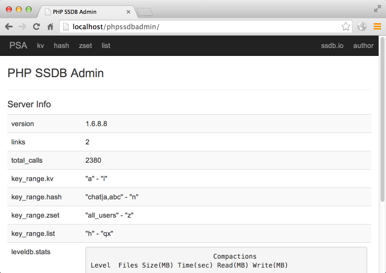
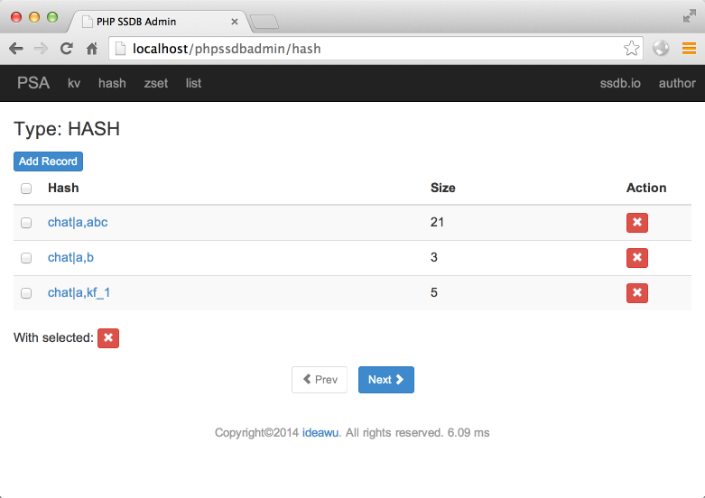

phpssdbadmin
============

## 安装

编辑 `app/config/config.php`:

	'servers' => array(
		array(
			'host' => '127.0.0.1',
			'port' => '8888',
		),
	),

将 `host` 和 `port` 修改成正确的值.

然后编辑你的 Nginx 配置文件, 加入一条 URL 重写规则:

	location /phpssdbadmin {
		try_files $uri $uri/ /phpssdbadmin/index.php?$args;
	}

__注意: 如果你还没有配置好 php, 请先配置好 php! 下面是一个示例, 但不保证你能完全理解. 如果你无法理解, 请在搜索引擎上学习如何配置 nginx+php, 谢谢!__

	index index.php;
	root /somewhere/htdocs
	location ~ \.php$ {
		include        fastcgi_params;
		fastcgi_pass   127.0.0.1:9000;
		fastcgi_param  SCRIPT_FILENAME  $document_root$fastcgi_script_name;
	}

如果你使用的是 Apache 的话, 你可以试试这条 URL 重写规则.

	<IfModule mod_rewrite.c>
	RewriteEngine On
	RewriteBase /phpssdbadmin/
	RewriteCond %{REQUEST_FILENAME} !-f 
	RewriteCond %{REQUEST_FILENAME} !-d 
	RewriteRule . /phpssdbadmin/index.php [L] 
	</IfModule>

### PHP 模块依赖

* php-gd
* php-mcrypt

phpssdbadmin
============

SSDB Admin Tool Built with PHP.

## Install

Edit `app/config/config.conf`:

	'servers' => array(
		array(
			'host' => '127.0.0.1',
			'port' => '8888',
		),
	),

Change `host` and `port` to the right values.

Then edit your Nginx configuration, add one URL rewrite rule as:

	location /phpssdbadmin {
		try_files $uri $uri/ /phpssdbadmin/index.php?$args;
	}

__Your have to set up nginx+php first!__

	index index.php;
	root /somewhere/htdocs
	location ~ \.php$ {
		include        fastcgi_params;
		fastcgi_pass   127.0.0.1:9000;
		fastcgi_param  SCRIPT_FILENAME  $document_root$fastcgi_script_name;
	}

If you are using Apache, try this URL rewrite rule:

	<IfModule mod_rewrite.c>
	RewriteEngine On
	RewriteBase /phpssdbadmin/
	RewriteCond %{REQUEST_FILENAME} !-f 
	RewriteCond %{REQUEST_FILENAME} !-d 
	RewriteRule . /phpssdbadmin/index.php [L] 
	</IfModule>

### PHP module dependency

* php-gd
* php-mcrypt

## Screeshots

